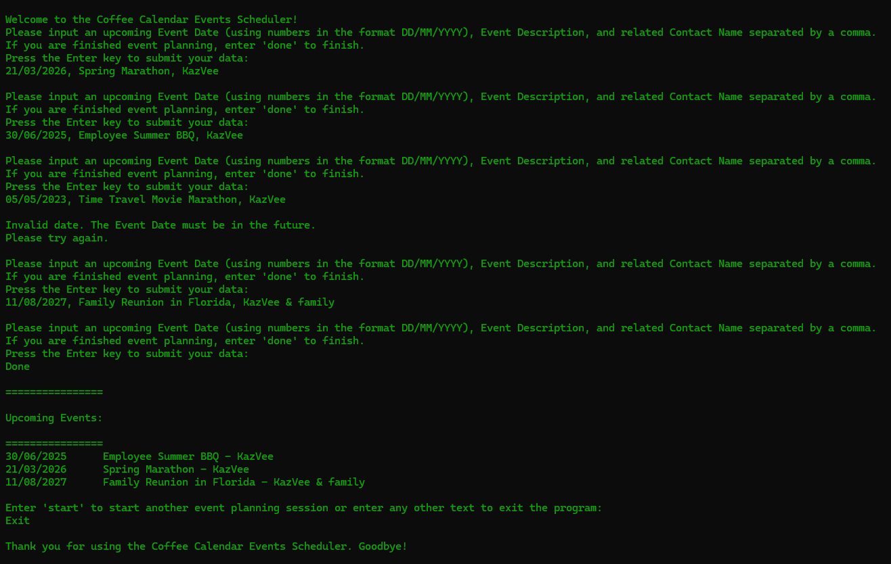

# Coffee Calendar Events Scheduler 💻

Coffee Calendar Events Scheduler is a console-based Java app that helps users create a schedule of upcoming events based on their input. ☕

Users are prompted to enter their event dates, descriptions, and contact names. Input validation ensures that no events entered are in the past. 📅

Once submitted, the events are sorted by date, with the soonest upcoming event listed first, helping users plan ahead for celebrations and special events. 🥳

## Screenshot

## Getting Started

### Prerequisites

- Java Development Kit (JDK) 21 or higher

### Installation

- Fork this repository to your own GitHub account
- Clone your fork onto your local device
- Compile the Java files using the `javac Main.java` command
- Run the app using the `java Main` command
- Follow the console prompts to create your events schedule 📅